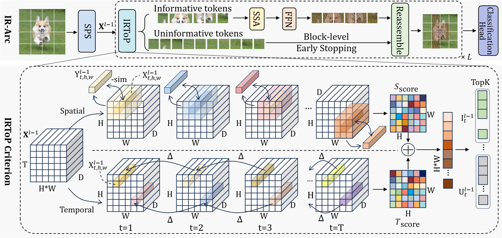
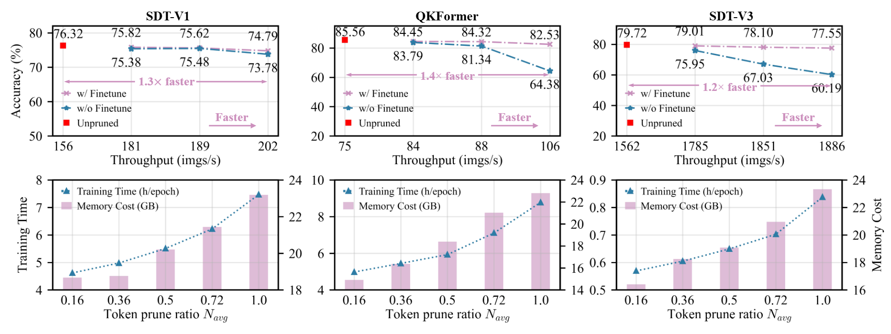

# TP-Spikformer: Token Pruned Spiking Transformer

[[Arxiv]](https://arxiv.org/abs/2603.00527)

This repository provides the official implementation of the paper [TP-Spikformer: Token Pruned Spiking Transformer](https://arxiv.org/abs/2603.00527) **(ICLR 2026)**.

## Abstract

Spiking neural networks (SNNs) offer an energy-efficient alternative to traditional neural networks due to their event-driven computing paradigm. However, recent advancements in spiking transformers have focused on improving accuracy with large-scale architectures, which require significant computational resources and limit deployment on resource-constrained devices. In this paper, we propose a simple yet effective token pruning method for spiking transformers, termed TP-Spikformer, that reduces storage and computational overhead while maintaining competitive performance. Specifically, we first introduce a heuristic spatiotemporal information-retaining criterion that comprehensively evaluates tokens' importance, assigning higher scores to informative tokens for retention and lower scores to uninformative ones for pruning. Based on this criterion, we propose an information-retaining token pruning framework that employs a block-level early stopping strategy for uninformative tokens, instead of removing them outright. This also helps preserve more information during token pruning. We demonstrate the effectiveness, efficiency and scalability of TP-Spikformer through extensive experiments across diverse architectures, including Spikformer, QKFormer and Spike-driven Transformer V1 and V3, and a range of tasks such as image classification, object detection, semantic segmentation and event-based object tracking. Particularly, TP-Spikformer performs well in a training-free manner. These results reveal its potential as an efficient and practical solution for deploying SNNs in real-world applications with limited computational resources.



## What Is Included

- `qk_drop`: QKFormer-related training, evaluation, and utility scripts.
- `sdt_drop`: SDT token-drop training and analysis scripts.
- `sdtv3_drop`: SDTv3 fine-tuning and evaluation scripts.
- `run.py`: one unified entrypoint; pass `--launcher torchrun` and set `--nproc_per_node` to the number of GPUs you use.

## Pretrained weights

This repository **does not host baseline checkpoints**. Download ImageNet (or task-specific) **pretrained weights from the original model releases** and pass them to `--finetune` / `--resume` as in the quick-start commands for training-free evaluation. Architecture definitions here follow those projects, so weights should be taken from the matching codebase.

| Model family | Original code & checkpoints |
|--------------|------------------------------|
| **QKFormer** | [zhouchenlin2096/QKFormer](https://github.com/zhouchenlin2096/QKFormer) |
| **Spike-driven Transformer (V1)** | [BICLab/Spike-Driven-Transformer](https://github.com/BICLab/Spike-Driven-Transformer) |
| **Spike-driven Transformer V3** | [BICLab/Spike-Driven-Transformer-V3](https://github.com/BICLab/Spike-Driven-Transformer-V3) |

For **Spikformer** (used in the paper for CIFAR series.), see the official release at [ZK-Zhou/spikformer](https://github.com/ZK-Zhou/spikformer).

## Repository Structure

```text
TP-Spikformer/
├── run.py
├── qk_drop/
│   └── train.py
├── sdt_drop/
│   ├── train_drop.py
│   └── conf/imagenet/*.yml
└── sdtv3_drop/
    └── main_finetune.py
```

## Requirements

```python3
pytorch >= 2.0.0
cupy
spikingjelly
timm==0.5.4
pyyaml
tensorboard
torchinfo
ptflops
```

## Unified entrypoint: `run.py` + `torchrun`

List all tasks:

```bash
python run.py --list-tasks
```

Default pattern (multi-GPU on one machine): use `--launcher torchrun` and set `--nproc_per_node` to the number you want on this node (e.g. `4` for four cards, `8` for eight).

```bash
python run.py --task <task-name> --launcher torchrun --nproc_per_node <NUM_GPUS> -- \
  <args-for-underlying-script>
```

- Replace `<NUM_GPUS>` with your actual GPU count.
- You can restrict which physical GPUs are visible, then match `nproc_per_node` to that count, for example:  
  `CUDA_VISIBLE_DEVICES=0,1,2,3` with `--nproc_per_node 4`.
- `run.py` wraps `python -m torch.distributed.run` with the same `nproc_per_node` / `master_port` style knobs as the `torchrun` CLI.

### Supported tasks

- `qk-train`: run `qk_drop/train.py`
- `qk-eval`: run `qk_drop/train.py` and auto-inject `--eval` if missing
- `sdt-train`: run `sdt_drop/train_drop.py`
- `sdt-eval`: run `sdt_drop/train_drop.py` and auto-inject `--eval` if missing
- `sdtv3-train`: run `sdtv3_drop/main_finetune.py`
- `sdtv3-eval`: run `sdtv3_drop/main_finetune.py` and auto-inject `--eval` if missing

## Quick start examples (all use `torchrun` + GPU count)

The examples below use `--nproc_per_node 8`; change that number to your machine’s GPU count.

### 1) Train QKFormer

```bash
python run.py --task qk-train --launcher torchrun --nproc_per_node 8 --master_port 29501 -- \
  --data_path /data/dataset/ImageNet \
  --output_dir ./outputs/qkformer \
  --log_dir ./outputs/qkformer \
  --batch_size 72 \
  --epochs 50 \
  --blr 1e-5 \
  --finetune /path/to/checkpoint.pth
```

### 2) Evaluate QKFormer

```bash
python run.py --task qk-eval --launcher torchrun --nproc_per_node 8 --master_port 29502 -- \
  --data_path /data/dataset/ImageNet \
  --batch_size 72 \
  --model QKFormer_10_768 \
  --resume /path/to/checkpoint.pth \
  --eval
```

### 3) Train SDT drop (YAML config)

```bash
python run.py --task sdt-train --launcher torchrun --nproc_per_node 1 --master_port 29503 -- \
  -c sdt_drop/conf/imagenet/8_512_300E_t4.yml \
  -data-dir /data/dataset/ImageNet \
  --output ./outputs/sdt_drop \
  --experiment sdt_drop_exp
```

### 4) Evaluate SDT drop

```bash
python run.py --task sdt-eval --launcher torchrun --nproc_per_node 8 --master_port 29504 -- \
  -c sdt_drop/conf/imagenet/8_512_300E_t4.yml \
  -data-dir /data/dataset/ImageNet \
  --resume /path/to/checkpoint.pth
```

### 5) Train SDTv3

```bash
python run.py --task sdtv3-train --launcher torchrun --nproc_per_node 1 --master_port 29505 -- \
  --batch_size 760 \
  --blr 1e-5 \
  --warmup_epochs 0 \
  --epochs 50 \
  --model Efficient_Spiking_Transformer_l \
  --data_path /data/dataset/ImageNet \
  --output_dir outputs/sdtv3_drop \
  --log_dir outputs/sdtv3_drop \
  --model_mode ms \
  --finetune /path/to/checkpoint.pth \
  --dist_eval 
```

### 6) Evaluate SDTv3

```bash
python run.py --task sdtv3-eval --launcher torchrun --nproc_per_node 2 --master_port 29506 -- \
  --batch_size 512 \
  --model Efficient_Spiking_Transformer_l \
  --data_path /data/dataset/ImageNet \
  --eval \
  --resume /path/to/checkpoint.pth
```

### Direct `torchrun` (optional)

If you prefer not to use `run.py`, the equivalent is to launch the same script with `torchrun` and the same per-process args:

```bash
torchrun --nproc_per_node=8 --master_port=29501 sdtv3_drop/main_finetune.py --data_path /path/to/imagenet --batch_size 64
```

## Modify token retention ratio

TP-Spikformer scores each spatial token with a **spatiotemporal information-retaining (IR) criterion**. The highest-scoring tokens are treated as **informative**: they go through the full attention / FFN path. The rest follow a **block-level early stopping** path so computation is reduced without dropping tokens from the tensor layout. In code this is implemented with **`torch.topk`**: only the top $k \times k$ tokens (for a square grid of side $k$ on the current feature map) get the expensive path; $k$ is what you change to adjust the **retention strength**.

Roughly, for a feature map of size $H \times W$, the fraction of tokens that receive the full block is about $(k^2)/(H \cdot W)$ (exact counts follow `topk` after flattening). Larger $k$ → more tokens retained → higher accuracy and cost; smaller $k$ → more aggressive pruning → lower cost.

Where to edit $k$ (per model family):

| Codebase | File | Parameter | Meaning |
|----------|------|-----------|---------|
| QKFormer | `qk_drop/qkformer.py` | `k_values` in the backbone (e.g. `QKFormer_*` builder) | Per-stage **ratio** `k_value`; implementation uses `k = int(H * k_value)` and keeps **`k × k`** tokens. |
| SDT (token drop) | `sdt_drop/model/sdt_drop.py` | `k_values` in `SpikeDrivenTransformer` | Per-block **integer** side length **`k`**; keeps **`k × k`** tokens at that depth. |
| SDTv3 | `sdtv3_drop/models_drop.py` | `k_values` in `Spiking_vit_MetaFormer_Spike_SepConv` | Per-stage **ratio** (same style as QKFormer): `k = int(H * k_value)`. |

## Zero-finetuning accuracy and efficiency

TP-Spikformer is applied on top of **existing pretrained spiking transformers without extra fine-tuning**. The IR criterion and block-level early stopping only **re-route computation** (which tokens get full attention / FFN); weights stay fixed. That makes TP a **plug-in deployment option**: you can shrink FLOPs and latency on a checkpoint you already have, while **accuracy often stays close to the dense baseline**—useful when retraining is expensive or impossible.

Token pruning means fewer tokens pass through the expensive path each block, so you typically get **lower SOPs**, **smaller activation footprint**, and **better throughput** on resource-limited devices. The exact trade-off vs. accuracy is controlled by the retention settings in [Modify token retention ratio](#modify-token-retention-ratio) (e.g. `k_values` / `k_value`).



## Citation

If you find this work useful, please cite our paper:

```bibtex
@inproceedings{
wei2026tpspikformer,
title={{TP}-Spikformer: Token Pruned Spiking Transformer},
author={Wenjie Wei and Xiaolong Zhou and Malu Zhang and Ammar Belatreche and Qian Sun and Yimeng Shan and Dehao Zhang and Zijian Zhou and Zeyu Ma and Yang Yang and Haizhou Li},
booktitle={The Fourteenth International Conference on Learning Representations},
year={2026},
url={https://openreview.net/forum?id=L5llQD0nMf}
}
```

## Contact

For questions regarding our work, please contact weiwenjie1999@gmail.com and xlzhou126@gmail.com.